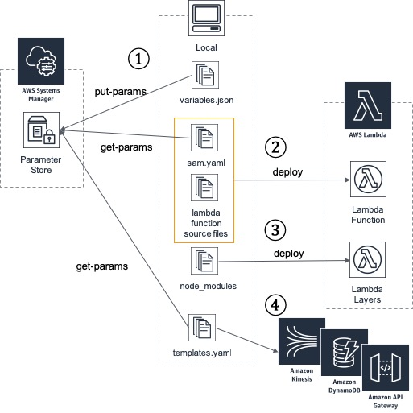

How it works
---




* 1: Manage parameters used in the whole application with a parameter store.
* 2: Deploy Lambda Function using AWS SAM.
* 3: Deploy `node_modules` to Lambda Layers using AWS SAM.
* 4: Deploy AWS resources using CloudFormation.


Deploy sample application
---

### requirements

* [AWS CLI](https://github.com/aws/aws-cli)
* [jq](https://github.com/stedolan/jq)
* AWS accessible CLI.
	* [tilfin/homebrew\-aws: AWS commands easy to manipulate on terminal](https://github.com/tilfin/homebrew-aws)
	* [waddyu/aws\_swrole: Switch AWS IAM Roles and start new session\.](https://github.com/waddyu/aws_swrole)
 
### Deploy

```bash
npm install
make push-params env=itg ns=cm  #update parameter store. 
```

* env: Environment name, such as *test*, *stage*, *production*.
* ng: Application namespace. Using S3 bucket prefix.  

```bash
make layer env=itg ns=cm
make deploy-note env=itg ns=cm  #deploy lambda function.
make infra-dynamodb_tables env=itg ns=cm  #deploy DynamoDB table.
```


Submit the following test data on the AWS Management Console.

```json
{
  "Records": [
    {
      "kinesis": {
        "data": "eyJkZXZpY2VUb2tlbiI6IiIsImxhdGl0dWRlIjoiMzUuNzAyMDY5MSIsImxvbmdpdHVkZSI6IjEzOS43NzUzMjY5IiwiZW5kcG9pbnRJZCI6IlhYWFgtMDcwMC00QTVFLVhYWFhYWFgiLCJkYXRlIjoxNTQ3MTk2ODI0ODMwLjMwNDJ9"
      }
    }
  ]
}
```

Data is written to DynamoDB.


Develop your application
---

### Edit parameters

`environments/env-ssm-parameters.json` has application parameters. If you want to add/modify parameters, edit the json file and re-push to parameter store, using:

```basj
make push-params env=xxx, ns=xxx
``` 

### Lambda function 

`src/handlers` has lambda function entry point. So, you can start developing new functions by adding files to handlers. 
After that, edit `webpack.config.js` to entry new function.

```js
...
module.exports = {
    mode: 'development',
    target: 'node',
    entry: {
        'location': path.resolve(__dirname, './src/lambda/handlers/location/location-transfer.ts'),
        
        // add
        'your-function': path.resolve(__dirname, './src/lambda/handlers/your/new-function.ts'), 
    },
```


Other infrastructures
---

`templates/` directory has AWS CloudFormation/SAM templates. So, if you want to add new AWS resources,
you can add template file and deploy. For example, add the following: 


`templates/infra_kinesis_streams.yaml`
```yaml 
AWSTemplateFormatVersion: '2010-09-09'
Resources:
  NoteDeviceLocationStream:
    Type: AWS::Kinesis::Stream
    Properties:
      Name: !Sub ${Env}-note-device-location-stream
      RetentionPeriodHours: 24
      ShardCount: 1
  NoteLambdaDeviceLocationEventSourceMapping:
    Type: AWS::Lambda::EventSourceMapping
    Properties:
      BatchSize: 100
      Enabled: true
      EventSourceArn: !GetAtt NoteDeviceLocationStream.Arn
      FunctionName: !Sub ${Env}-note-transfer-location
      StartingPosition: LATEST
```

``bash
make infra-kinesis_streams env=xxx, ns=xxx
``
